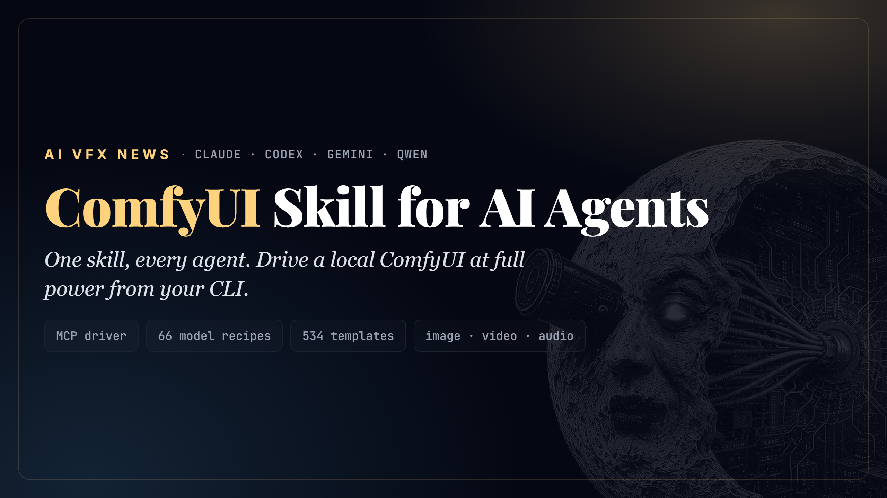
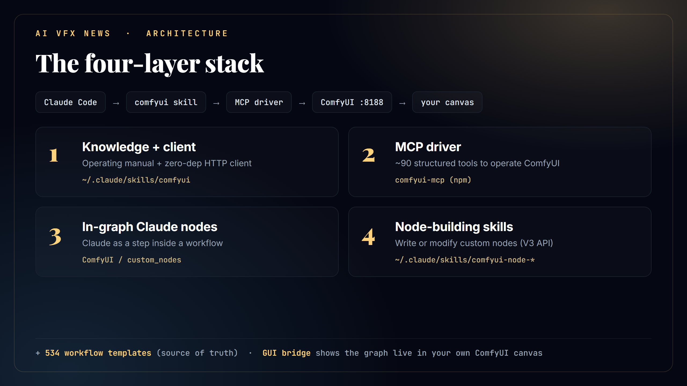
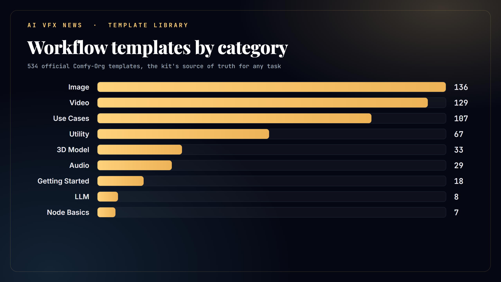
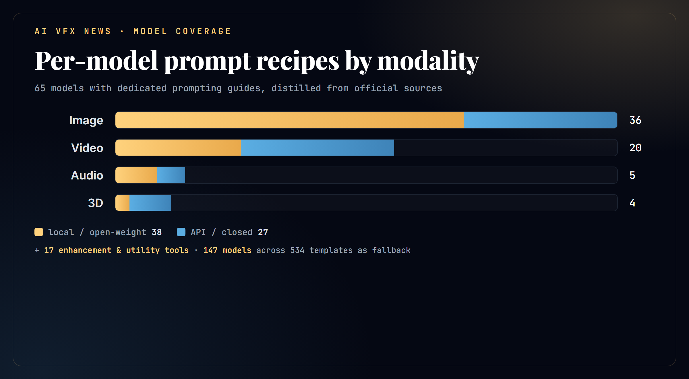

<div align="center">



# comfyui-agent-kit

**The signature ComfyUI skill for AI coding agents: Claude Code, Codex, Gemini CLI, and Qwen Code.**

**By [AI VFX NEWS](https://t.me/AI_VFX_NEWS).**

Make your AI coding agent drive a local **ComfyUI** at full power, generate images, video, and audio, build and
run workflows, and **show the graph live in your own ComfyUI canvas**, then hand the whole setup to someone else
with one command.


</div>

---

This is the portable, machine-independent, **multi-agent** version of a working ComfyUI setup. One shared core
(the knowledge + the MCP driver) plus a thin adapter per agent. Clone it, run the installer, and each of your
agents gets the same stack, wired to *your* hardware. GLM (z.ai) run through Claude Code is covered by the
`claude` adapter. See **[docs/AGENTS.md](docs/AGENTS.md)** for how each agent connects.

## What it can do

- **Drive ComfyUI from four agents** (Claude Code, Codex, Gemini CLI, Qwen Code) off one shared core. GLM via
  Claude Code is covered too. ([docs/AGENTS.md](docs/AGENTS.md))
- **~90-tool MCP driver.** The agent operates ComfyUI directly: generate, build / edit / validate graphs, queue,
  download models, manage VRAM, read logs, diagnose.
- **Per-model "mega-brain":** 65 prompt recipes distilled from **official sources** (image, video, audio, 3D);
  the agent auto-pulls the right recipe when you name a model, so it prompts each one in its own dialect.
- **Knows where each model runs:** a [full index](docs/MODEL_INDEX.md) of all 147 library models (recipe /
  utility / template-only), local vs API.
- **Hardware-aware model selection:** detects your VRAM, RAM, and free disk, then recommends the variant that
  fits (fp8 / offload / multi-GPU / quant) and refuses a download that won't fit, before wasting the bandwidth.
- **18 enhancement and utility tools:** upscale / restore (Real-ESRGAN, SUPIR, SeedVR2), frame interpolation
  (FILM, RIFE), segmentation / depth / pose (SAM3, BiRefNet, Depth Anything), plus restoration chains.
- **534-template library** as the source of truth, plus **fetch any shared workflow by hash** and a **model
  shootout** (run a prompt through many models small, pick the winner, then scale up).
- **Assembles new workflows from parts:** decomposes a task into stages, mixes templates and blueprint subgraphs,
  and wires the nodes correctly (output-to-input by type, with converters where needed), validated against
  `/object_info` before running. Not a preset runner.
- **Starts ComfyUI for you:** when the server is down, the agent launches it headless in the background and
  generates (no need to open the app first); to peek, you open `http://127.0.0.1:8188` in a browser. For an
  unattended pipeline the start policy is configurable per project (env vars or a `.comfyui-agent.json`), so it
  never blocks on a prompt.
- **GUI bridge + persistence:** the agent writes graphs into your ComfyUI canvas, and SAVES every workflow it
  builds or runs to ComfyUI's workflows folder, so you can open it later from the Workflows sidebar (an API
  generation alone leaves no trace on the canvas).
- **Stays current on its own:** `check_updates.py` diffs the template repo and reads the blog RSS; an optional
  weekly task adds recipes for new models and pushes them. ([docs/UPDATING.md](docs/UPDATING.md))
- **Portable and idempotent:** one installer, auto-detects your agents, re-runnable. MIT, no vendored third-party
  code (everything heavy is fetched at install).

## The four-layer stack

<div align="center">



</div>

| Layer | What | Installed as |
|------:|------|--------------|
| 1 | **Knowledge + client** the operating manual and a zero-dependency HTTP client | the agent's skill / extension dir |
| 2 | **MCP driver** ~90 structured tools so the agent operates ComfyUI directly | `comfyui-mcp` (npm) + per-agent MCP registration |
| 3 | **In-graph Claude nodes** an LLM as a step inside a workflow (prompt enrichment, vision QA) | ComfyUI `custom_nodes` |
| 4 | **Node-building skills** for writing/modifying custom nodes (V3 API) | the agent's skill dir (Claude/Codex) |
| + | **Template library** the official 500+ workflow templates, the source of truth | sparse git clone + quick index |

Plus a **GUI bridge**: the agent writes graphs to `<ComfyUI>/user/default/workflows/`, you open them in the
built-in Workflows sidebar and tweak them. No extra "agent panel" node required.

See [docs/LAYERS.md](docs/LAYERS.md) for each layer, and [docs/AGENTS.md](docs/AGENTS.md) for the per-agent matrix.

## The template library is the source of truth

The kit clones the official [Comfy-Org/workflow_templates](https://github.com/Comfy-Org/workflow_templates) and
builds a compact lookup index so the agent can match any request to the right template. 534 templates span every
task, image, video, 3D, audio, utilities:

<div align="center">



</div>

## It knows every model's dialect

Each generative model rewards a different prompt approach: SDXL wants comma tags, FLUX wants natural-language
sentences, video models want camera and motion direction, audio models want genre/tempo/instruments, and
negative-prompt support varies wildly. The kit ships **[`MODELS.md`](skills/comfyui/MODELS.md)**, a per-model
prompting reference distilled from **official sources** (each maker's docs and model cards, docs.comfy.org, and
the per-model templates from the `anthropic-claude` node). When you name a model in a request or a workflow,
the agent reads that model's entry first and prompts it correctly.

Covered today (65 models with recipes): FLUX.1/.2 + Kontext, Z-Image, Qwen-Image/Edit, SDXL, SD1.5/3.5, HiDream,
Ideogram, Nano Banana Pro/2, Seedream, Recraft, GPT-Image, Grok, Reve, Kandinsky, BRIA, OmniGen, Chroma, Krea,
ERNIE-Image, FireRed/LongCat/ChronoEdit (edit), Capybara, Bernini-R, Anima, NewBie, PixelDiT, Ovis-Image, Lens,
Quiver, Wan 2.1-2.7, LTX-2.3/2 Pro, Hunyuan Video, SVD, Kling, Veo, Sora, Seedance, Luma, Runway, MiniMax, PixVerse,
Vidu, Pika, HappyHorse, HuMo, SCAIL-2, Stable Audio, ACE-Step, ElevenLabs, ChatterBox, Sonilo, Hunyuan3D, Tripo,
Rodin, Meshy. Plus a separate **Enhancement and utility** section (not prompt-driven, settings not prompts):
upscalers and restorers (Real-ESRGAN, SUPIR, SeedVR2, FlashVSR, Topaz, Magnific), frame interpolation (FILM, RIFE),
conditioning helpers (SAM3, BiRefNet, Depth Anything, DWPose, MoGe, IP-Adapter, LivePortrait, Mediapipe), and video
object removal (VOID). Anything else falls back to the template library.

<div align="center">



</div>

**Full model index**: every model in the library and exactly what the kit has for it (recipe / utility /
template-only): **[docs/MODEL_INDEX.md](docs/MODEL_INDEX.md)**.

### Coverage table: every model and whether a prompt recipe is ready

`✅ recipe` = a dedicated, up-to-date prompting guide in [MODELS.md](skills/comfyui/MODELS.md). `🔧 tool` = an
enhancement/utility note (settings, not prompts). **Updated: 2026-06-19 23:08.**

One table, columns aligned to the widest row (the video models).

| Modality | Model / tool | Prompt recipe | Runs |
|---|---|:---:|---|
| Image | FLUX.1 / FLUX.2 / Kontext | ✅ | local + API |
| Image | Z-Image-Turbo | ✅ | local |
| Image | Qwen-Image / Edit | ✅ | local |
| Image | SDXL · SD 1.5 · SD 3.5 | ✅ | local |
| Image | HiDream-I1 | ✅ | local |
| Image | BRIA 3.x | ✅ | local |
| Image | OmniGen v1/v2 | ✅ | local |
| Image | Chroma | ✅ | local |
| Image | Krea 1 | ✅ | local |
| Image | ERNIE-Image | ✅ | local |
| Image | Capybara (image+video) | ✅ | local |
| Image | Bernini-R (relight) | ✅ | local |
| Image | Anima (anime) | ✅ | local |
| Image | NewBie (anime, XML prompts) | ✅ | local |
| Image | PixelDiT | ✅ | local |
| Image | Ovis-Image (text rendering) | ✅ | local |
| Image | Lens / Lens Turbo | ✅ | local |
| Image | Quiver (text to SVG) | ✅ | API |
| Image | Ideogram 2/3 | ✅ | API |
| Image | Nano Banana Pro / 2 | ✅ | API |
| Image | Seedream 4/5 | ✅ | API |
| Image | Recraft V3 | ✅ | API |
| Image | GPT-Image | ✅ | API |
| Image | Grok Image | ✅ | API |
| Image | Reve | ✅ | API |
| Image | Kandinsky 3.x | ✅ | local + API |
| Image edit | FireRed / LongCat / ChronoEdit | ✅ | local |
| Video | Wan 2.1-2.7 (+VACE/Animate/ATI) | ✅ | local + API |
| Video | LTX-2.3 / LTX-2 Pro | ✅ | local |
| Video | Hunyuan Video | ✅ | local |
| Video | SVD (image-to-video) | ✅ | local |
| Video | HuMo (lip-sync) | ✅ | local |
| Video | SCAIL-2 (character) | ✅ | local |
| Video | HappyHorse 1.0 | ✅ | API |
| Video | Kling (1.6-3.0, O1/O3) | ✅ | API |
| Video | Veo 3/3.1 | ✅ | API |
| Video | Sora 2 | ✅ | API |
| Video | Seedance 1.0/1.5/2.0 | ✅ | API |
| Video | Luma Ray · Runway Gen-4/4.5 | ✅ | API |
| Video | MiniMax/Hailuo · PixVerse · Vidu · Pika | ✅ | API |
| Audio | Stable Audio · ACE-Step · ChatterBox | ✅ | local |
| Audio | ElevenLabs · Sonilo | ✅ | API |
| 3D | Hunyuan3D | ✅ | local |
| 3D | Tripo · Rodin · Meshy | ✅ | API |
| Enhance / utility | Real-ESRGAN, SUPIR, SeedVR2, FlashVSR (upscale/restore) | 🔧 settings | local |
| Enhance / utility | Topaz, Magnific (upscale) | 🔧 settings | API |
| Enhance / utility | FILM, RIFE (frame interpolation) | 🔧 settings | local |
| Enhance / utility | SAM3, BiRefNet (segmentation/matting) | 🔧 settings | local |
| Enhance / utility | Depth Anything v2/v3, MoGe (depth/geometry) | 🔧 settings | local |
| Enhance / utility | DWPose, Mediapipe (pose/landmarks) | 🔧 settings | local |
| Enhance / utility | IP-Adapter, LivePortrait (conditioning/portrait) | 🔧 settings | local |
| Enhance / utility | VOID (video object removal) | 🔧 settings | local |

Niche models still without a recipe (very new, thin docs) run from their template and borrow the closest family's
approach; see [docs/MODEL_INDEX.md](docs/MODEL_INDEX.md) for the full per-variant breakdown.

## Prerequisites

- One or more agent CLIs on PATH: [Claude Code](https://claude.com/claude-code) (`claude`),
  [Codex](https://developers.openai.com/codex) (`codex`), [Gemini CLI](https://github.com/google-gemini/gemini-cli)
  (`gemini`), [Qwen Code](https://github.com/QwenLM/qwen-code) (`qwen`)
- [Node.js](https://nodejs.org) (`node` + `npm`)
- [git](https://git-scm.com), [Python 3](https://python.org)
- A local **ComfyUI** install (Desktop or source), [comfy.org](https://www.comfy.org/)

## Install

Windows (PowerShell):

```powershell
git clone https://github.com/SlavaSexton/comfyui-agent-kit.git
cd comfyui-agent-kit
./install.ps1 -ComfyUIPath "E:\path\to\ComfyUI"   # installs for every agent CLI found on PATH
```

Linux / macOS:

```bash
git clone https://github.com/SlavaSexton/comfyui-agent-kit.git
cd comfyui-agent-kit
./install.sh --comfyui-path /path/to/ComfyUI       # installs for every agent CLI found on PATH
```

The installer runs the shared machine setup once (MCP package, templates, in-graph nodes), then **auto-detects**
which of `claude` / `codex` / `gemini` / `qwen` are installed and wires each one. It is **idempotent**, re-run it
any time. Limit the targets with `-Agents claude,gemini` / `--agents claude,gemini`. Flags: `-SkipTemplates` /
`--skip-templates` (skip the ~900MB template clone), `-SkipNodes` / `--skip-nodes`. Per-agent details and the GLM
note are in **[docs/AGENTS.md](docs/AGENTS.md)**.

## First run on a new machine

After install, start ComfyUI, then in an agent session tell it to run the **bootstrap** once
([docs/BOOTSTRAP.md](docs/BOOTSTRAP.md)): it detects your GPUs, VRAM, RAM, free disk, paths, and installed models
via the MCP `health_check`, fills the machine-specific block in the skill, and does a smoke-test generation. After
that, just ask for media. On Claude/Codex the skill auto-activates on ComfyUI keywords; on Gemini/Qwen the
knowledge is loaded as the extension's context.

## Optional: in-graph LLM key

Only needed if you want a workflow to enrich prompts **without** the agent in the loop (e.g. an unattended pipeline):

```powershell
setx CLAUDE_API_KEY "sk-ant-..."   # then restart ComfyUI
```

See [docs/NODES.md](docs/NODES.md). When you are driving, the agent writes prompts directly, better and free.

## Layout

```
comfyui-agent-kit/
├── install.ps1 / install.sh         top-level: shared setup + auto-detect agents + run adapters
├── shared/
│   ├── comfyui/                     SKILL.md + MODELS.md + comfy_client.py  (one source of truth)
│   └── tools/gen_quick_index.py     rebuild the template lookup index
├── agents/
│   ├── claude/   install.ps1/.sh    -> ~/.claude/skills/comfyui + claude mcp add + CLAUDE.md
│   ├── codex/    install.ps1/.sh    -> ~/.agents/skills/comfyui + ~/.codex/config.toml
│   ├── gemini/   install.ps1/.sh    -> ~/.gemini/extensions/comfyui (gemini-extension.json + GEMINI.md)
│   └── qwen/     install.ps1/.sh    -> ~/.qwen/extensions/comfyui (qwen-extension.json + QWEN.md)
├── docs/AGENTS.md                   per-agent matrix (how each connects) + GLM note
├── docs/MODEL_INDEX.md              every model in the library and what the kit has for it
├── docs/EXAMPLE_WORKFLOWS.md        notable shared workflows (model shootouts, restoration) + fetch helper
├── docs/UPDATING.md                 stay current: check_updates.py (templates diff + blog RSS) + the loop
├── docs/BOOTSTRAP.md / LAYERS.md / NODES.md
├── ATTRIBUTION.md                   credits for fetched third-party pieces
├── CHANGELOG.md                     curated history of notable changes (Keep a Changelog)
└── LICENSE                          MIT (this kit's original files)
```

## What is and isn't in this repo

In the repo (original work, MIT): the skill, the client, the installer, the index generator, the docs, the
generated visuals. Fetched at install time from their own sources (not redistributed here): the `comfyui-mcp`
package, the node-building skills, the workflow templates, and the in-graph Claude nodes.

## Credits and thanks

This kit stands on excellent open-source work. It is a thin wiring layer over these projects, and the heavy
lifting is theirs. Huge thanks to:

- **[ComfyUI](https://github.com/comfyanonymous/ComfyUI)** by comfyanonymous / Comfy-Org, the engine everything
  runs on.
- **[comfyui-mcp](https://github.com/artokun/comfyui-mcp)** by [artokun](https://github.com/artokun), the MCP
  driver (Layer 2) that lets the agent operate ComfyUI with structured tools.
- **[comfyui-custom-node-skills](https://github.com/jtydhr88/comfyui-custom-node-skills)** by
  [jtydhr88 / Terry Jia](https://github.com/jtydhr88), the node-building skills (Layer 4).
- **[workflow_templates](https://github.com/Comfy-Org/workflow_templates)** by Comfy-Org, the template library
  that is the source of truth.
- **[comfyui-anthropic-claude](https://github.com/alexmunteanu/comfyui-anthropic-claude)** by
  [alexmunteanu](https://github.com/alexmunteanu) and
  **[comfyui_claude_prompt_generator](https://github.com/PauldeLavallaz/comfyui_claude_prompt_generator)** by
  [PauldeLavallaz](https://github.com/PauldeLavallaz), the in-graph Claude nodes (Layer 3).

v1.1.0 builds on more excellent work. Thanks also to:

- **[Prompt Relay](https://github.com/GordonChen19/Prompt-Relay)** by Gordon Chen, Ziqi Huang, and Ziwei Liu
  (S-Lab, NTU), the training-free temporal prompt-routing method (arXiv 2604.10030).
- **[ComfyUI-PromptRelay](https://github.com/kijai/ComfyUI-PromptRelay)** and
  **[ComfyUI-SUPIR](https://github.com/kijai/ComfyUI-SUPIR)** by [kijai](https://github.com/kijai), the ComfyUI
  ports this kit recommends and drives.
- **[LTX Director 2.0](https://github.com/WhatDreamsCost/WhatDreamsCost-ComfyUI)** by WhatDreamsCost, the LTX-2.3
  timeline-editor node.
- **[Z-Image-Turbo Fun-ControlNet-Union](https://huggingface.co/alibaba-pai/Z-Image-Turbo-Fun-Controlnet-Union-2.1)**
  by alibaba-pai (PAI), plus the **LTX-2.3** model and **HDR IC-LoRA** by [Lightricks](https://huggingface.co/Lightricks).
- **[Real-ESRGAN](https://github.com/xinntao/Real-ESRGAN)** by Xintao Wang and the BasicSR team, and **SUPIR** by
  the XPixel Group (Fanghua Yu et al.), the upscale and restore models. Note: the SUPIR weights are non-commercial.

Field techniques in wide community use lean on:

- **[KJNodes](https://github.com/kijai/ComfyUI-KJNodes)** by [kijai](https://github.com/kijai) (LTX-2.3 NAG, GGUF
  loading, chunked feed-forward, multi-guide), **[ComfyUI-CacheDiT](https://github.com/Jasonzzt/ComfyUI-CacheDiT)** by
  Jasonzzt (inference caching), **ComfyUI-MelBandRoFormer** (audio stem separation),
  **[ComfyUI-Frame-Interpolation](https://github.com/Fannovel16/ComfyUI-Frame-Interpolation)** by Fannovel16 (FILM),
  **comfyui-inpaint-cropandstitch** (Flux.2 masked inpaint), and
  **[GAP LTX 2.3 Motion](https://github.com/GeekatplayStudio/LTX-2-3-LipSync)** by GeekatplayStudio
  (lipsync / storyboard / long audio).

Full per-component licensing is in [ATTRIBUTION.md](ATTRIBUTION.md). If anything here misattributes your work,
open an issue and it will be fixed.

## License

MIT, see [LICENSE](LICENSE). Third-party components keep their own licenses.

<div align="center">

Made by **[AI VFX NEWS](https://t.me/AI_VFX_NEWS)**

</div>
